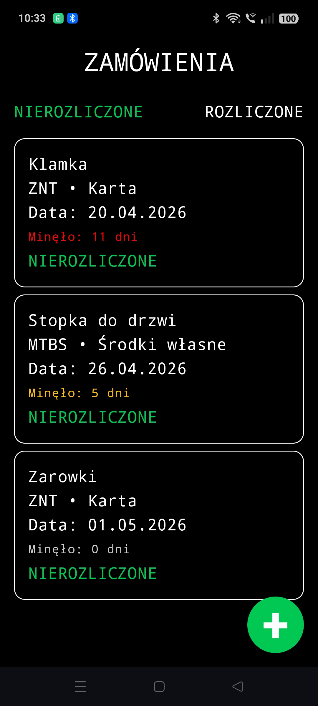

## ZamówieniaAPP

Aplikacja mobilna na Androida do zarządzania zamówieniami i kontrolowania ich rozliczenia.

---

### Opis

Aplikacja umożliwia dodawanie zamówień oraz monitorowanie ich statusu (rozliczone / nierozliczone).  
Każde zamówienie posiada datę dodania, na podstawie której obliczana jest liczba dni od momentu utworzenia. Pozwala to kontrolować zaległe i nierozliczone zamówienia.

---

### Funkcje

- Dodawanie nowych zamówień  
- Podgląd szczegółów zamówienia  
- Oznaczanie zamówienia jako rozliczone  
- Cofanie statusu rozliczenia  
- Usuwanie zamówień  
- Automatyczne liczenie dni od daty zamówienia  
- Wizualne oznaczenie czasu oczekiwania (kolory)  
- Sortowanie nierozliczonych zamówień od najstarszych  
- Wyświetlanie daty rozliczenia  

---

### Działanie

- Zamówienia nierozliczone są sortowane od najstarszych do najnowszych  
- Wyświetlana jest liczba dni od momentu dodania zamówienia  
- Zamówienia rozliczone nie pokazują licznika dni  
- Dane zapisywane są lokalnie w bazie danych  

---

### Technologie

- Kotlin  
- Jetpack Compose  
- Room  
- Material 3  

---

### Screenshots

